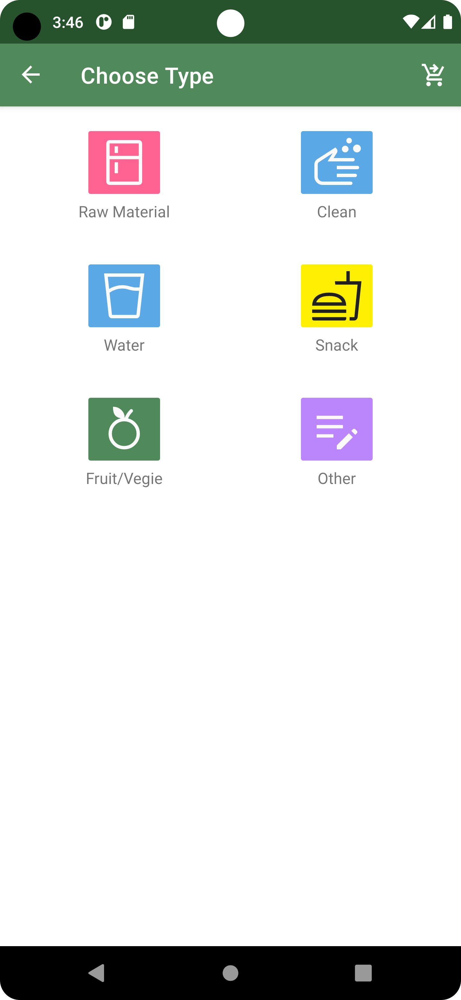
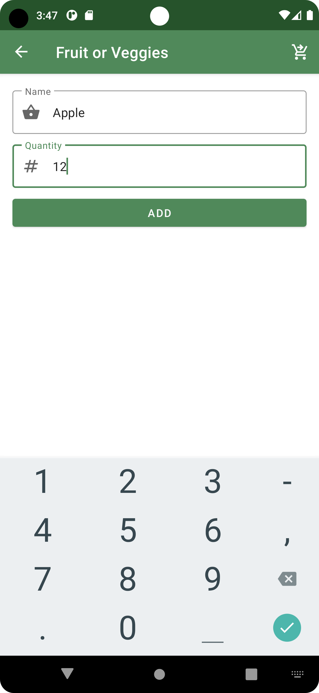
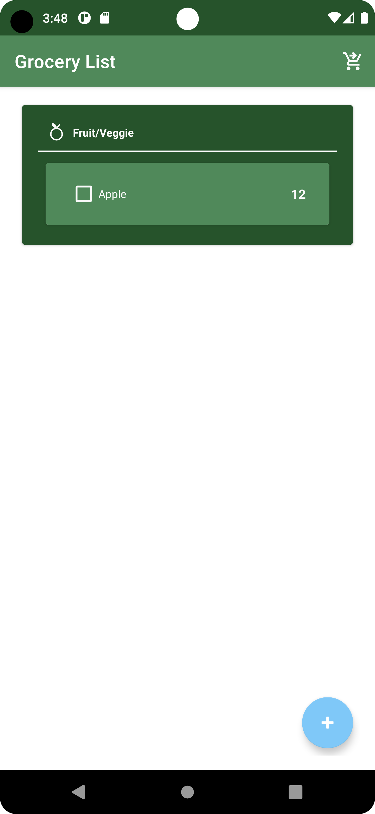
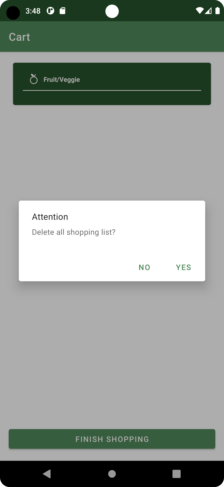

# Grocery List Android Application
Grocery List App that uses Kotlin-XML, open to #hacktoberfest


## Overview

The Grocery List Android Application is a simple and intuitive mobile app designed to help users manage their grocery shopping lists with ease. Whether you're planning your weekly shopping trip or making a last-minute run to the store, this app has you covered. It allows you to create, edit, and organize your grocery lists, making your shopping experience more efficient and organized.

## Features

- **Create and Manage Lists**: Easily create and manage multiple grocery lists for different occasions and store locations.

- **Add Items**: Quickly add items to your shopping lists by typing or using voice recognition.

- **Check Off Items**: Mark items as "completed" when you add them to your cart.

- **Edit and Delete**: Edit or remove items from your lists as needed.

- **Categories and Tags**: Organize items by categories or add custom tags for better organization.

- **Share Lists**: Share your shopping list with family members or friends to collaborate on your shopping.

- **Sort and Filter**: Sort items by name, category, or status. Apply filters to view specific items.

- **Offline Access**: Use the app without an internet connection; your data will sync when you're back online.

## Screenshots
<div align="center">




</div>

## Installation and Adding your first PR:

- Fork this repo (button on top)
- Clone on your local machine

```terminal
git clone https://github.com/jayneeel/Hacktober-TicTacToe.git
```
- Navigate to project directory.
```terminal
cd <Directory Name>
```

- Create a new Branch

```markdown
git checkout -b my-new-branch
```
- Add your files
```markdown
git add <file names>
```
- Commit your changes.

```markdown
git commit -m "Summarize the changes you have done"
```
- Then push 
```markdown
git push origin my-new-branch
```


- Create a new pull request from your forked repository
## License

This project is licensed under the MIT License. For more details, please see the [LICENSE](LICENSE) file.

## Contact

If you have any questions, suggestions, or issues, please feel free to contact us at https://www.linkedin.com/in/victor-immanuel/

Thank you for using the Grocery List Android Application! Happy shopping! 🛒


